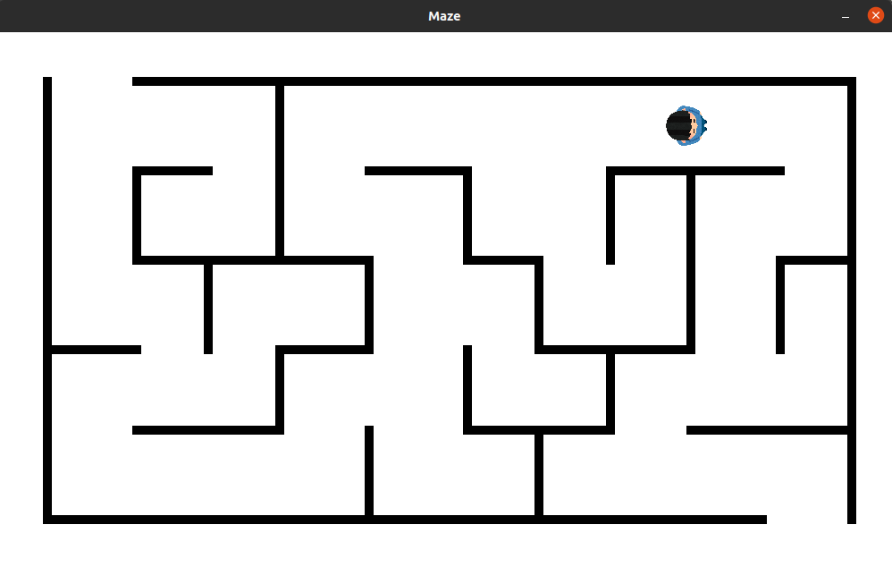

# Maze
This is a maze simulation, where you can use arrow keys on your keyboard to move around with your main character and try to find a way out of the maze. It's kind of a very easy 2D game, nothing complicated. Have fun.

# Tools:
Python (3.8.5), module Pygame (1.9.6)

# How it looks like:

# License:
The code is available under the [MIT](https://github.com/MartinTam/Maze/blob/main/LICENSE) license.
